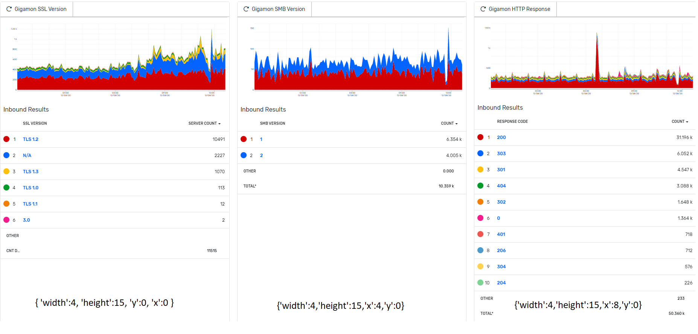
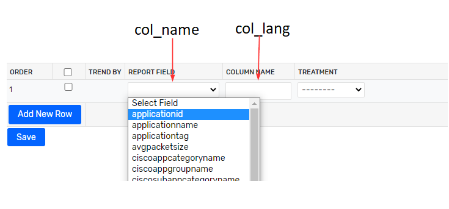

# Scrutinizer Dashboard Maker

A project that helps Users and Engineers create 'quick start' dashboards for Scrutinizer deployments. 

## Commands


* `python dashboard_maker.py --make [dashboard name]` - call the main function to build your dashboards and desinged  reports.
* `python dashboard_maker.py --delete [dashboard name]` - call the delete_all function to remove your dashboard and designed reports.


## Pre-Build Dashboard Commands  

* `python dashboard_maker.py --make gigamon` - Create the pre-built gigamon dashboard.
* `python dashboard_maker.py --delete gigamon` - Delete pre-built gigamon dashboard.
* `python dashboard_maker.py --make palo` - Create the pre-built Palo Alto dashboard.
* `python dashboard_maker.py --delete palo` - Delete pre-built Palo Alto dashboard.


## Project layout

    config/
        db_creds.ini   # The configuration file. This is where the user will fill out required DB usernames / passwords.
    docs/ 
        index.md  # The documentation homepage.
    modules/
        dashboard_handler.py # Handles creating queries needed for dashboard creating and management. 
        db_handler.py # Responsible for establishing connections to the database and executing queries.
        json_handler.py # Many of the database queries require a JSON object as part of the query. This class contains various methods for generating those JSON objects. 
        report_designer.py # In the event that your dashboard required reports that are not native to Scrutinizer, they can be designed using the report_designer method. 
        report_handler.py # Used to generate the SQL needed for making Saved Reports and fetching ID's. 
        report_maker.py # Function that is used to execute all of the designed report SQL in the proper order. 
    custom_dashboards/ #This is where users can add in there own custom dashboards as desired. 
        gigamon/ #pre-built Gigamon dashboard ready to be used.
            dashboards/ #pre-built dashboards
                gigamon_counts.py 
                gigamon_dns.py
                gigamon_sus.py
            designed_reports/ #since the gigamon dashbaords rely on reports that are not native to Scrutinizer, they will be created as the script runs. Those reports are stored here.
                gigamon_reports.py #holds all of the reports to be created for the Gigamon dashboard
    dashboard_maker.py #primary file used to execute the created of dashboards. Holds a variety of methods that receive the necessary object for dashboard creation.


## Modifying the Script

If you would like to create a dashboard outside of what is provided you will need to:

* create a **project directory** in  'custom_dashboards'  hold your new dashboard(s). 
    * Add a **dashboards** sub directory
    * Add a **designed reports** sub directory - only if you intend on using reports that aren't out of the box with Scrutinizer. 


    ### Example Folder Structure

        custom_dahboards/
            my_new_project/
                dashboards/
                designed_reports/


* within the dashboards folder create a python file that will hold the gadget objects, this documentation will use <i>my_example_dash.py</i> as a file name (as seen below)


        custom_dahboards/
            my_new_project/
                dashboards/
                    my_example_dash.py
                designed_reports/


    ### Global Variables

    These globale variables are passed into each dashboard object, the could be ommited and placed into each object manually if desired 

        dashboard_name = 'Name of Dashboard to be Created'

        exporter = 'in_GROUP_ALL' # this will use all exporters, alternativaly you could use an object for the exporters you want.

        user_id = 1 # Part of making the dashbaords required yout o make the dashboard visible to a user. 1 represents the default admin user. 

    ### Dashboard Objects

    Each dashboard object <b>MUST</b> have all of the key / value pairs shown below. if you omit any of them you will throw an error and terminate the script. 
    
    These objects are responsible for: 

    1.) Creating the Dashboard 

    2.) Creating Saved Reports 

    3.) Converting those Saved Reports into Gadgets

    4.) Moving those Gadgets to the Dashboard in the correct position. 

    
    #### Example Dashboard Objects
```json
report_1 = {
    "name" : "Name for Gadget1",    
    "lang" : "report lang key", 
    "filters" : {}, 
    "position" : { "width":4, "height":15, "y":0, "x":0 },
    "direction":"inbound",
    "time_range":"Last24Hours",
    "data_type": "total",
    "stacked":"stacked",
    "exporter": exporter,
    "view":"tableGraph",
    "user_id":user_id,
    "dashboard": dashboard_counts
}

report_2 = {
    "name" : "Name for Gadget2",    
    "lang" : "report lang key", 
    "filters" : {}, 
    "position" : { "width":4, "height":9, "y":14, "x":0 },
    "direction":"inbound",
    "time_range":"Last24Hours",
    "data_type": "total",
    "stacked":"stacked",
    "exporter": exporter,
    "view":"tableGraph",
    "user_id":user_id,
    "dashboard": dashboard_counts
}
```
```
example_gadgets_list = [report_1, report_2] #all gadgets are put into a list and imported into main program file
```
    
    
* <b>lang</b> : this is the report lang key, examples would be things like "conversationsWKP" or "applications"
* <b>filters</b> : if you do not want any filters in your gadget leave this blank, otherwise you can pass them into it. 
    * as an example adding {"sdfPorts_0":"in_53-17"} to filters would filter the gadget for DNS traffic
* <b>position</b> : Determins where each gadget will be placed. This is a little tricky to understand at first. The best approach I have found is to build a sample dashboard in the UI and look at <i>plixer.dash_tabs</i> in the databse to see what the positioning object looks like. This example image demonstrates how the position objects places each gadget in our sample gigamon dashboard. 



### Adding Designed Reports

The <b>lang</b> key used in each dashboard object can reference a 'out of the box' Scrutinizer report, or it can reference the lang_key of a report you have created in report designer. 

This Script offers a way to create designed reports as part of the dashboard creation. In order to utilize this you will need to add a python file into your designed_reports directory this file will hold one (or multiple) designed report the can be imported into the main file. We will use <i>my_example_reports.py</i> as a file name for this documenation. 


        custom_dahboards/
            my_new_project/
                dashboards/
                    my_example_dash.py
                designed_reports
                    my_example_reports.py

In order to create a designed report in Scrutinizer there are 5 database tables that are modified. 


* plixer.report_types;
* plixer.report_types_select;
* plixer.report_types_groupby;
* plixer.report_types_operations;
* languages.custom;

***It's imporant to note that each key in the example object provided below match the fields in the database. To really get a feel for how to use this utilitly I find the best way is to create the report you want with Report Designer in the Scrutinizer UI and then look at each of the database tables for that report this will allow you to make sure you are replicating the report in the correct way, it will also help you troubleshoot any bugs your run into ***. 


#### Example Designed Report Object

```json 
example_designed_report = [

[
                {"headers":{
                        "rpt_lang":"custom_exampledefined",
                        "pretty_name":"My Example Report",
                        "menu_group": 23,
                        "graph_type":"stacked",
                        "bi_width":950,
                        "totals_table":0
                    }},
                    
                    {"group_by":{
                    "col_name":"srcipgroup",
                    "col_order":1,
                    "col_lang":"Src Group",
                    "col_style":"width_dynamic",
                    "col_header_title_attr":"null",
                    "col_width":"dynamic",
                    "manufactured": 1}},
                    {"group_by":{
                    "col_name":"sourceipaddress",
                    "col_order":2,
                    "col_lang":"Src IP",
                    "col_style":"width_dynamic",
                    "col_header_title_attr":"null",
                    "col_width":"dynamic",
                    "manufactured": 'null'}},
                    {"group_by":{
                    "col_name":"applicationid",
                    "col_order":3,
                    "col_lang":"App",
                    "col_style":"width_dynamic",
                    "col_header_title_attr":"null",
                    "col_width":"dynamic",
                    "manufactured": 'null'}},

                    {"select":{
                    "col_name":"octetdeltacount",
                    "manufactured": 'null'}},
                
                    

                {"trend_by":{
                    "col_name_sum":"sum_octetdeltacount",
                    "col_nam_reg":"octetdeltacount",
                    "col_order":7,
                    "col_lang":"Bits",
                    "col_style":"alignRight,dataWidth,width_dynamic",
                    "col_header_title_attr":"null",
                    "col_width":"dynamic",
                    "col_operation":"sum",
                    "default_col":1,
                    "availableratetotals":"rate,total",
                    "defaultratetotal":"total",
                    "availablegraphstyles":"stacked,nonStacked",
                    "defaultgraphstyle":"stacked",
                    "showother":0,
                    "percentok":0,
                    "units":'bB',
                    "total_operation":"sum",
                    "lowbad":0,
                    "manufactured": 'null'}}                            
                
                    

                ]


]

```

A designed report at a mininum will contain 3 unique objects. 

#### "headers" 

The headers object is primarily used to populate <i>plixer.report_types</i> and <i>languages.custom</i>

* <b>rpt_lang</b>: Key that is referenced for the report throughout the database.Pre-pending it with 'custom_' is a useful way to seperate designed report from default reports in the database, I would reccomend this as a styling suggestion. 

* <b>pretty_name</b>: Name the report will show up as in the report menu. 

* <b>menu_group</b>: This determines which menu the report will be available in. 23 represents "designed reports"


***rpt_langs must be a single string all lowercase, without spaces or special charectors***  

#### "group_by"

Think of <b>group_by</b> objects as the columns you want the designed report to include. 

* <b>col_name</b> : Same as "Report Field" in the Scrutinizer report designer UI. Whatever you put in here must match a possible Report Field in the product. 

* <b>col_lang</b> : Think of this as what you want the column to be named as in the report. Same as "Column Name" in report designer.



* <b>manufactured</b>: This will need to be set to 1 if the <b>col_name</b> you are using is a manufactured column (E.G srcipgroup) or 'null' if it is a standard <b>col_name</b> (E.G sourceipaddress)

* <b>col_order</b>: Starts with number one and increments by 1 for each group_by object you add. This will be how the columns are ultimately laid out in the report. 


#### "trend_by"

* <b>col_nam_reg</b> : This object is used to determine what you want to trend the report by. Popular options would be <b>plixeraggregatedrecordcount</b> (number of flows) or <b>octetdeltacount</b> (number of bits)

* <b>col_name_sum</b> : Same is <b>col_nam_reg</b> but you will need to prepend it with whatever operation method you are choosing (sum, avg, etc)

* <b>units</b> : If you are using <b>octetdeltacount</b>  you will need the string 'bB' for units, if you are using <b>plixeraggregatedrecordcount</b> you will need a blank string ''. 


#### "select" 

This is a special object that is only used in certain reports. It is responsible for inserting the <b>col_nam_reg</b> into plixer.report_types_select; if required. 

Namely - if you are using octetdeltacount, you will want to include the select object, if you are using plixeraggregatedrecord count you can omit it. 

*** To repeat myself, building a couple designed reports in the UI and walking the DB tables for those reports will give you a better understanding of how all this gets glued together ***


#### Exporting the Designed Reports

You will place each designed report into an variable at the bottom of your Script. This will late be imported into the main file. 

```
example_reports_list = [example_designed_report ]
```
### Importing and running

In the root of the project you will need to import your newly created dashboard_object(s) and designed_report object(s) into the <i>dashboard_maker.py</i> file. 

This can be done at the top of the file use the prebuilt gigamon dashboards as a reference for the formatting. 

#### Importing Dashboards

```
#prebuilt dashboards

from custom_dashboards.gigamon.dashboards.gigamon_counts import count_monitor
from custom_dashboards.gigamon.dashboards.gigamon_sus import sus_monitor
from custom_dashboards.gigamon.dashboards.gigamon_dns import dns_monitor

#newly created dashboards
from custom_dashboards.my_new_project.dashboards.my_example_dash import example_gadgets_list 

```

#### Importing Designed Reports

```
#prebuilt designed reports
from custom_dashboards.gigamon.designed_reports.gigamon_reports import gigamon_reports_list

#newly created designed report
from custom_dashboards.my_new_project.designed_reports.my_example_reports import example_reports_list  
```

#### Adding Command Line References

The script use --make and --delete to handle creating the dashboards and deleting them. Update this function to include a reference you would like passed into the command line.

In the below example 

* `python dashboard_maker.py --make myexampledash` - Would Create my new dashboard
* `python dashboard_maker.py --delete myexampledash` - Would delete my new dashboard.


* `main()`
    * This functiont takes in the designed report list as your first argument, and then as many dashboard object as you like as the following. If you do not have a designed report object, just put in your dashboard objects. 
* `delete_all()`
    * This functiont takes in the designed report list as your first argument, and then as many dashboard object as you like as the following. If you do not have a designed report object, just put in your dashboard objects. 

```

if __name__ == "__main__":

    if args.make == 'gigamon':
        print(f"making dashboard for {args.make}")
        main(gigamon_reports_list, dns_monitor, sus_monitor, count_monitor)
    elif args.delete == 'gigamon':
        delete_all(gigamon_reports_list, dns_monitor, sus_monitor, count_monitor)

    ## here you can add in your own flags. 
    elif args.make == 'myexampledash':
        main(example_reports_list, example_gadgets_list )

    elif args.delete == 'myexampledash':
        delete_all(example_reports_list , example_gadgets_list )
    

```

